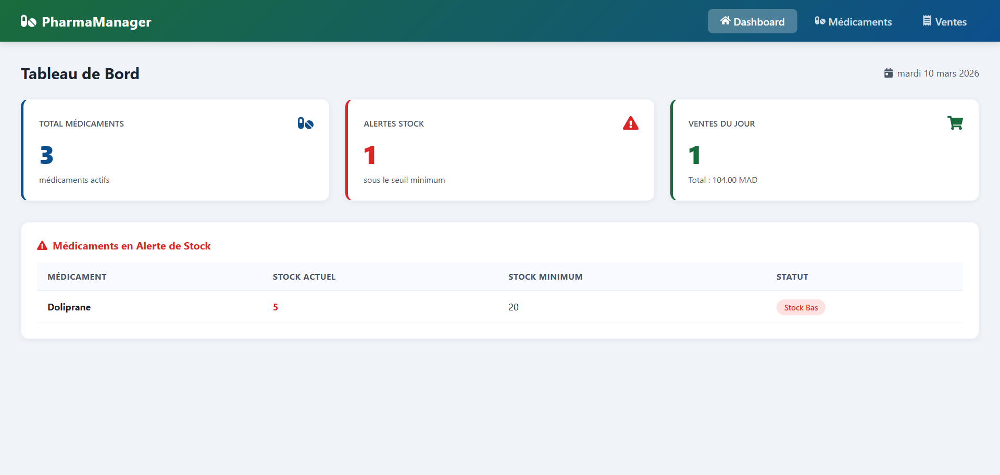
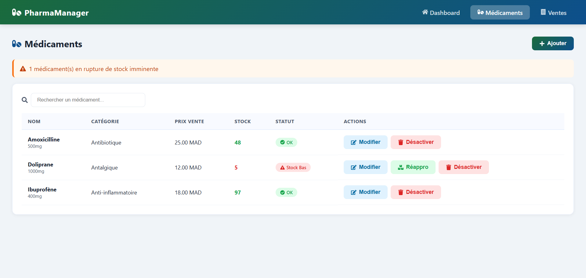
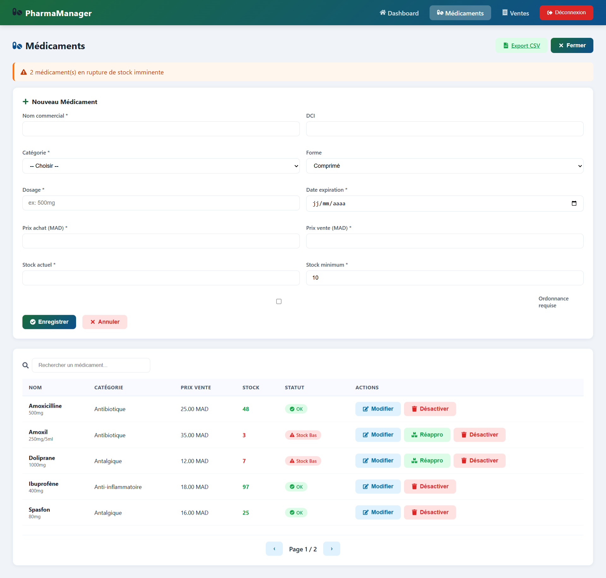
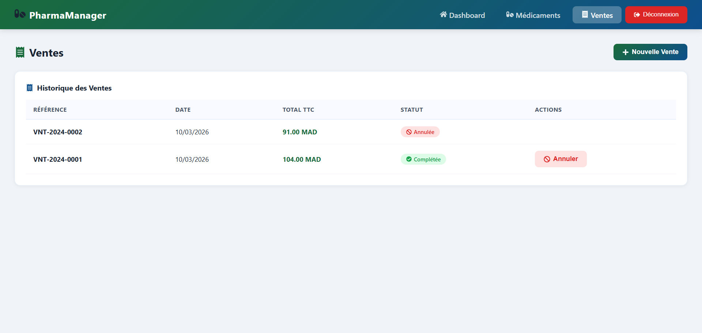
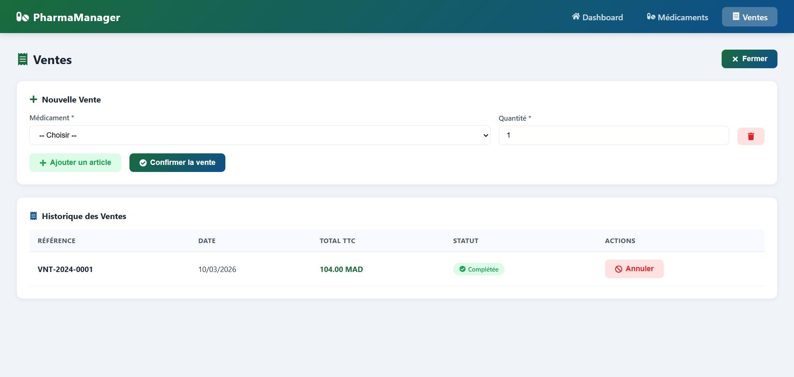

# PharmaManager

Application web de gestion de pharmacie développée dans le cadre du test technique SMARTHOLOL.



---

## Stack Technique

| Côté | Technologies |
|------|-------------|
| Backend | Python, Django 5.x, Django REST Framework |
| Base de données | PostgreSQL |
| Documentation API | Swagger (drf-spectacular) |
| Frontend | React.js (Vite 4), Axios, React Router |
| Versioning | Git & GitHub (Conventional Commits) |

---

## Fonctionnalités

- Gestion complète des médicaments (CRUD + soft delete)
- Alertes automatiques de stock bas
- Réapprovisionnement du stock
- Gestion des catégories de médicaments
- Création de ventes multi-articles avec déduction de stock automatique
- Annulation de vente avec réintégration du stock
- Dashboard avec indicateurs clés (KPIs)
- Documentation API Swagger interactive
- Architecture clean code (séparation api / hooks / components)

---

## Apercu de l'Application

### Dashboard


### Medicaments


### Formulaire Ajout et Modification


### Ventes


### Formulaire Nouvelle Vente


---

## Installation Backend

### Prerequis
- Python 3.10+
- PostgreSQL

### Etapes
```bash
cd backend

# Creer et activer l'environnement virtuel
python -m venv venv
source venv/bin/activate        # Linux/Mac
venv\Scripts\activate           # Windows

# Installer les dependances
pip install -r requirements.txt

# Configurer les variables d'environnement
cp .env.example .env
# Modifier .env avec vos valeurs
```

### Variables d'environnement Backend
```env
DEBUG=True
SECRET_KEY=your-secret-key
DB_NAME=pharma_db
DB_USER=postgres
DB_PASSWORD=your-password
DB_HOST=localhost
DB_PORT=5432
```

### Creer la base de donnees
```bash
psql -U postgres
CREATE DATABASE pharma_db;
\q
```

### Lancer le serveur
```bash
python manage.py migrate
python manage.py runserver
```

---

## Installation Frontend

### Prerequis
- Node.js 18+

### Etapes
```bash
cd frontend

# Installer les dependances
npm install

# Configurer les variables d'environnement
cp .env.example .env
```

### Variables d'environnement Frontend
```env
VITE_API_URL=http://localhost:8000/api/v1
```

### Lancer le serveur
```bash
npm run dev
```

---

## Documentation API

Swagger UI accessible sur :
```
http://localhost:8000/api/schema/swagger-ui/
```

### Endpoints principaux

| Methode | Endpoint | Description |
|---------|----------|-------------|
| GET | `/api/v1/medicaments/` | Liste des medicaments |
| POST | `/api/v1/medicaments/` | Creer un medicament |
| PUT/PATCH | `/api/v1/medicaments/{id}/` | Modifier un medicament |
| DELETE | `/api/v1/medicaments/{id}/` | Soft delete |
| GET | `/api/v1/medicaments/alertes/` | Medicaments en alerte |
| GET | `/api/v1/categories/` | Liste des categories |
| POST | `/api/v1/ventes/` | Creer une vente |
| POST | `/api/v1/ventes/{id}/annuler/` | Annuler une vente |

---

## Structure du Projet
```
pharma-manager/
├── backend/
│   ├── apps/
│   │   ├── medicaments/    # Gestion des medicaments
│   │   ├── ventes/         # Gestion des ventes
│   │   └── categories/     # Gestion des categories
│   ├── config/             # Configuration Django
│   ├── .env.example
│   ├── requirements.txt
│   └── manage.py
├── frontend/
│   ├── src/
│   │   ├── api/            # Couche d'acces aux donnees
│   │   ├── hooks/          # Custom React hooks
│   │   ├── components/     # Composants reutilisables
│   │   └── pages/          # Pages de l'application
│   └── .env.example
├── docs/
│   └── screenshots/        # Captures d'ecran
└── README.md
```

---

## Développé par

Douae Zayani
SMARTHOLOL — 2026